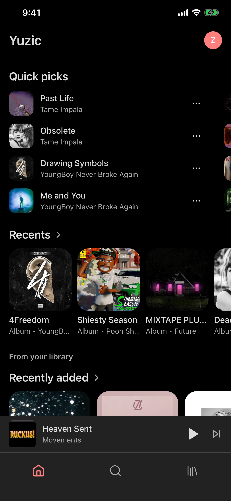
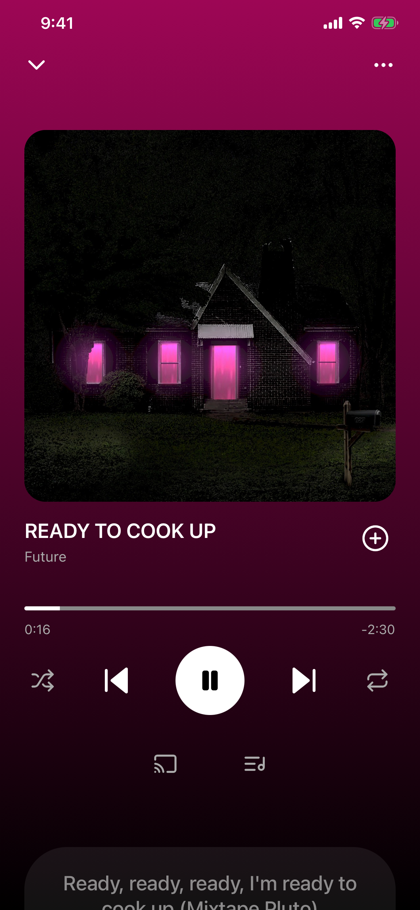
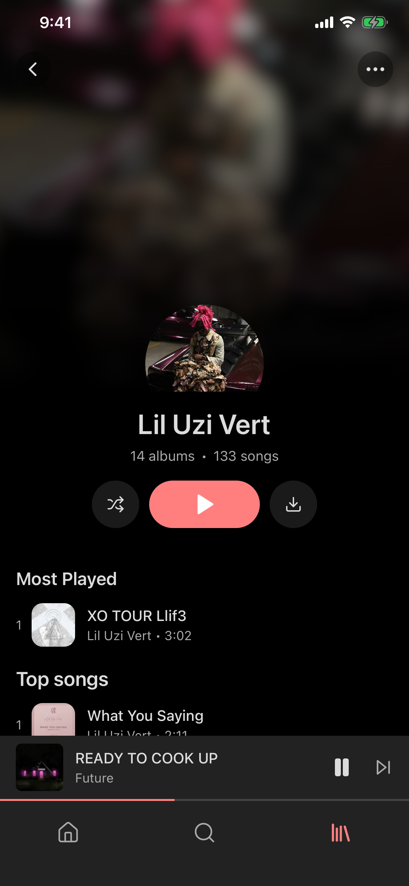
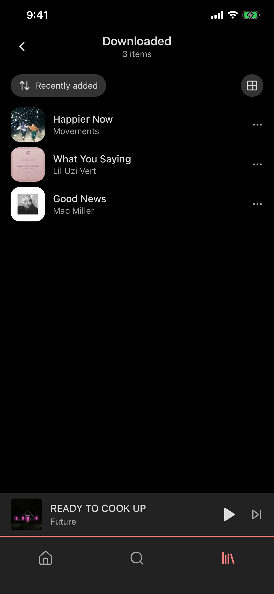

  

  # Yuzic

  A free, open-source music player for Navidrome, Jellyfin, Emby, and other Subsonic-compatible servers — on iPhone, iPad, and Android.

  
  
  
  

## Features

- **Your music, your server** — connect Navidrome, Jellyfin, Emby, or another Subsonic-compatible server.
- **Native playback** — streaming up to lossless quality, crossfade, replay gain, a ten-band equalizer, sleep timer, playback speed, and autoplay.
- **Works offline** — download songs, albums, and playlists; changes made offline sync when you reconnect.
- **A complete library** — browse artists, albums, tracks, playlists, and genres; search on-device or through your server.
- **Play it elsewhere** — use AirPlay on iOS, DLNA/UPnP on your network, or your server's jukebox where available.
- **Private by default** — optional integrations stay off until you enable them.

## Screenshots

| Home | Player | Artist | Offline |
|:----:|:------:|:------:|:-------:|
|  |  |  |  |

## Contributing

Contributions are welcome. Read [CONTRIBUTING.md](CONTRIBUTING.md) for local setup and checks, open an [issue](https://github.com/yuzicapp/yuzic/issues) to discuss a change, or join us on [Discord](https://discord.gg/NzsGEhg5Fs).
